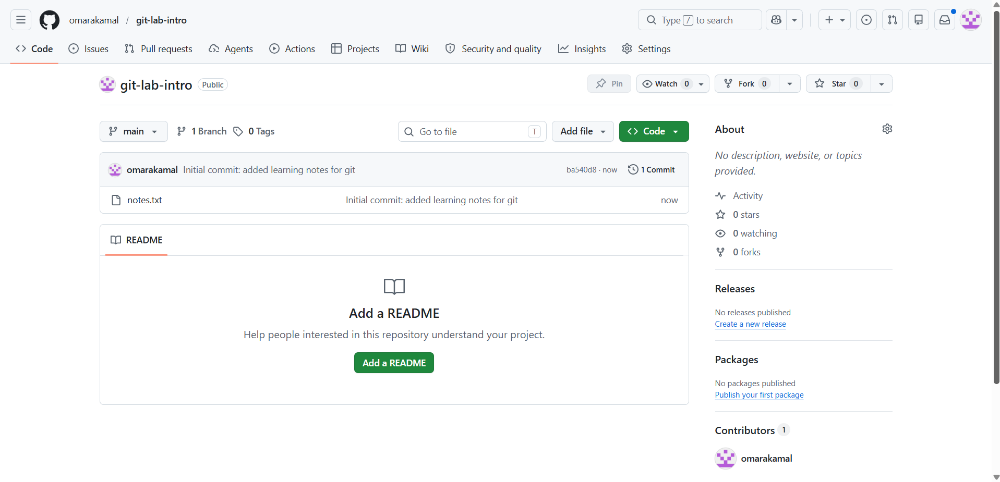
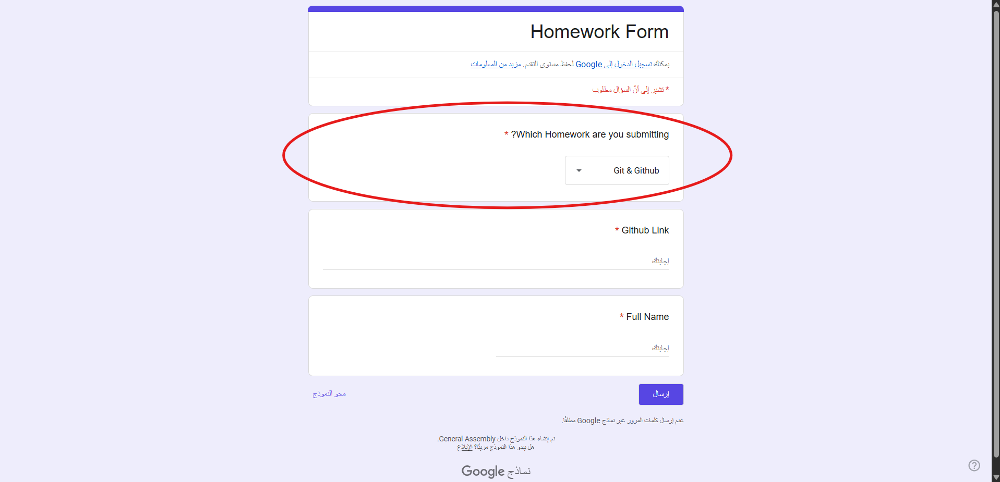
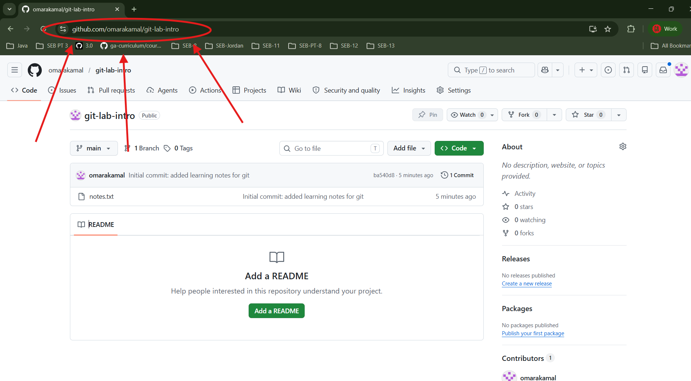
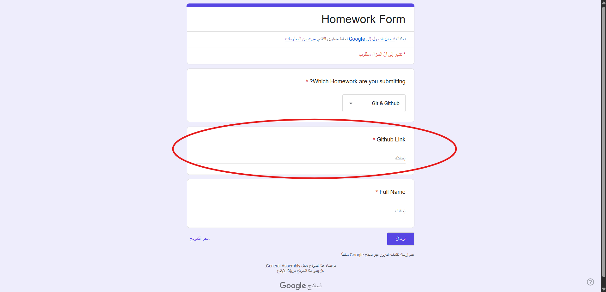

<h1>
  <span class="headline">Git & GitHub Lab</span>
  <span class="subhead">Exercise</span>
</h1>

In this lab, you will create a small notes project and publish it to GitHub.

> 💡 Read each step carefully. Save your file before running Git commands.


## Step 1: Add initial content

In `notes.txt` paste this text into the file:

```txt
GITHUB LAB

1. What is the first command you always need to initialize a git repository?

ANSWER:


2. You see your friend pushed code to their repository with the following commit message "done!". Is this a good commit message? Why or why not?

ANSWER:
```

Answer both questions in the file.

Save the file.

- Windows: `Ctrl` + `S`
- macOS: `Command` + `S`

> ⚠️ Git can only track changes that have been saved.

## Step 2: Check the repository status

Run:
```bash
git status
```

You should see that `notes.txt` is untracked (might look like "<span style="color: red; font-weight: bold;">modified: notes.txt</span>").

This means Git sees the file, but it is not staged yet.


## Step 3: Stage the file

Run:
```bash
git add .
```

Check the status again:
```bash
git status
```

You should see that `notes.txt` is now tracked and changed from red to green (might look like "<span style="color: green; font-weight: bold;">modified: notes.txt</span>").


## Step 4: Make your first commit

Run:
```bash
git commit -m "Adds learning notes for git"
```

A **commit** is a saved point in your project history.

Use commit messages that clearly explain what changed.


## Step 5: Push your local changes to GitHub.com

Run:
```bash
git push origin main
```


## Step 6: Check that your code pushed

Go back to your GitHub repository page in the browser.

Refresh the page.

Check that `notes.txt` is visible in the repository.

**Checkpoint:** You should see something like this on GitHub.




## Step 7: Make a change

Open `notes.txt` on your computer again.

Add your name to the bottom of the file.

Save the file.

- Windows: `Ctrl` + `S`
- macOS: `Command` + `S`


## Step 8: Stage, commit and push the updated file

#### Stage

```bash
git status
git add .
git status
```

#### Commit

```bash
git commit -m "Add name to notes.txt file"
```

#### Push

```bash
git push origin main
```

This sends your latest commit to GitHub.

## Step 9: Confirm the second push

Go back to your GitHub repository page.

Refresh the page.

Open `notes.txt` and confirm that your name appears in the file.

## Step 10: Submit the lab

We will do this part together in class.

Go to the [Homework Submission Link](https://forms.gle/UvX1VpLLWAqwJh5g8).

Choose the lab from the dropdown menu.



Copy the link to the GitHub repository you just pushed to.



Paste the link into the submission form for `Link to your homework repo`.



Don't forget to:
- Fill in your name
- Leave us any notes (was it too easy?  Do you need extra help finishing it?  Did you notice an error?)
- Let us know if you used AI to help you finish

Click **Submit**.

Great work. This is how you will submit homework moving forward.

## Keep these steps handy

```bash
git status
git add .
git status
git commit -m "message"
git push origin main
```