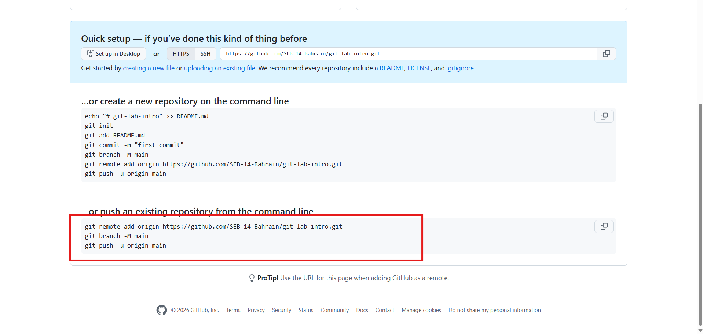

<h1>
  <span class="headline">Git & GitHub Lab</span>
  <span class="subhead">Exercise</span>
</h1>

In this lab, you will create a small notes project and publish it to GitHub.

By the end, you should have:

- A local folder named `git-lab-intro`
- A file named `notes.txt`
- At least two Git commits
- A GitHub repository with your work pushed to it
- A submitted GitHub repository link

> 💡 Read each step carefully. Save your file before running Git commands.

## Step 1: Create a folder in your labs folder

In your terminal, make sure you are inside your `labs` folder.

Create a new folder named `git-lab-intro`:

```bash
mkdir git-lab-intro
```

Move into the new folder:

```bash
cd git-lab-intro
```

Create a file named `notes.txt`:

```bash
touch notes.txt
```

> 💡 On Windows, if `touch` does not work, you can create the file from VS Code or File Explorer.

Check that the file was created:

```bash
ls
```

You should see `notes.txt`.

**Checkpoint:** Your terminal should show the `notes.txt` file.


## Step 2: Add initial content

Open the folder in VS Code:

```bash
code .
```

Open `notes.txt` and paste this text into the file:

```txt
GITHUB LAB

1. What is the first command you always need to initialize a git repository?

ANSWER:


2. You see your friend pushed code to their repository with the following commit message "done!". Is this a good commit message? Why or why not?

ANSWER:
```

Answer both questions in the file.

Save the file.

- Windows: `Ctrl` + `S`
- macOS: `Command` + `S`

> ⚠️ Git can only track changes that have been saved.


## Step 3: Initialize Git

Inside the `git-lab-intro` folder, run:

```bash
git init
```

This command turns your folder into a Git repository.

A **Git repository** is a folder where Git can track changes.


## Step 4: Check the repository status

Run:

```bash
git status
```

You should see that `notes.txt` is untracked.

This means Git sees the file, but it is not staged yet.


## Step 5: Stage the file

Run:

```bash
git add .
```

This stages all saved changes in the current folder.

> 💡 Staging means you are preparing changes for a commit.


## Step 6: Make your first commit

Run:

```bash
git commit -m "First commit: added learning notes for git"
```

A **commit** is a saved point in your project history.

Use commit messages that clearly explain what changed.


## Step 7: Create a GitHub repository

Go to [GitHub](https://github.com/new) and create a new repository.

Use these settings:

- ✅ Repository name: `git-lab-intro`
- ✅ Visibility: Public
- ❌ Do **not** initialize the repository with a `README.md`
- ❌ Do **not** add a `.gitignore`
- ❌ Do **not** add a license


## Step 8: Connect your local repository to GitHub.com and push

GitHub will show commands that connect your local repository to the GitHub.com repository.

Copy the commands from GitHub and paste them into your terminal.




## Step 9: Check that your code pushed

Go back to your GitHub repository page in the browser.

Refresh the page.

Check that `notes.txt` is visible in the repository.

**Checkpoint:** You should see something like this on GitHub.


## Step 10: Make a change

Open `notes.txt` on your computer again.

Add your name to the bottom of the file.

Save the file.

- Windows: `Ctrl` + `S`
- macOS: `Command` + `S`


## Step 11: Stage, commit and push the updated file

#### Stage

```bash
git add .
```

#### Commit

```bash
git commit -m "Add name to notes.txt file"
```

#### Push

```bash
git push origin main
```

This sends your latest commit to GitHub.

## Step 12: Confirm the second push

Go back to your GitHub repository page.

Refresh the page.

Open `notes.txt` and confirm that your name appears in the file.

## Step 13: Submit the lab

We will do this part together in class.

Go to the [Homework Submission Link](https://forms.gle/UvX1VpLLWAqwJh5g8).

Choose the lab from the dropdown menu.


Copy the link to the GitHub repository you just pushed to.


Paste the link into the submission form for `Link to your homework repo`.


Don't forget to:
- Fill in your name
- Leave us any notes (was it too easy?  Do you need extra help finishing it?  Did you notice an error?)
- Let us know if you used AI to help you finish

Click **Submit**.

Great work. This is how you will submit homework moving forward.