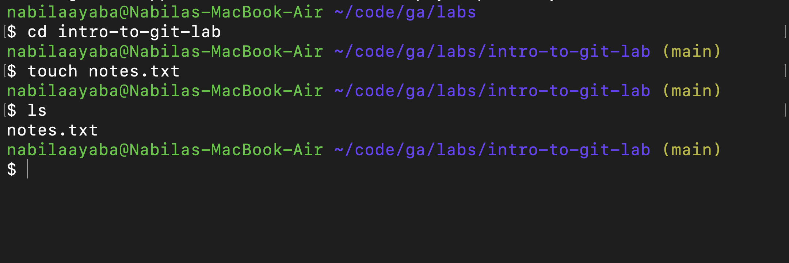

<h1>
  <span class="headline">Git & GitHub Lab</span>
  <span class="subhead">Setup</span>
</h1>

## Requirements

Before starting, make sure you have:

- Git installed
- A GitHub account
- A `labs` folder where you save class lab work
- VS Code installed

## Open your terminal

Open your Terminal application and navigate to your **`~/code/ga/labs`** directory:

```bash
cd ~/code/ga/labs
```

Navigate to [GitHub](https://github.com/) and create a new repository named **intro-to-git-lab**.

**Use these settings:**
* ✅ Repository name: `intro-to-git-lab`
* ✅ Visibility: Public
* ❌ Do **not** initialize the repository with a `README.md`
* ❌ Do **not** add a `.gitignore`
* ❌ Do **not** add a license

Using the `Quick Setup` option, clone your newly created repo into your `~/code/ga/labs` directory with the `git clone` command:

```bash
git clone https://github.com/<your-username>/intro-to-git-lab.git
```

> Note: In the link above, where it says `<your-username>`, you should see the username from your GitHub account.

Next, `cd` into your new cloned directory, `intro-to-git-lab`:

```bash
cd intro-to-git-lab
```

Create a file named `notes.txt`:

```bash
touch notes.txt
```

### Checkpoint 

- Run the `ls` command
- Your terminal should show the `notes.txt` file.




Open the folder in VS Code:

```bash
code .
```

You are ready to begin!